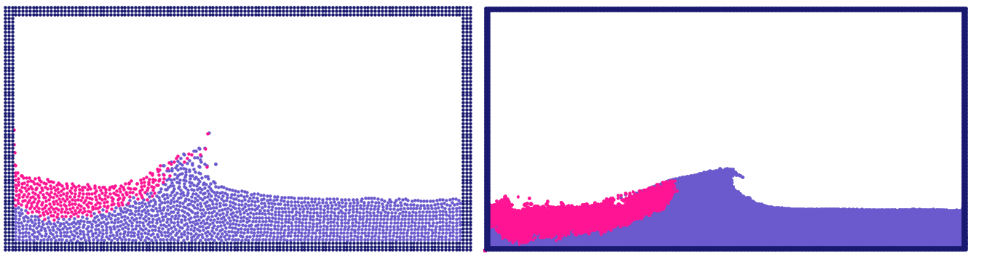

# SPH
Smoothed Particle Hydrodynamics (SPH) using OpenMP

Figs: Snapshot of 20x10 m tank with 2000 particles (left), 20000 particles (right).

**Compilation**

with OpenMP: g++ sph.cpp -O3 -fopenmp

without OpenMP: g++ sph.cpp -O3

**Post-processing**

python3 post_sph.py

**Further implementations**

- Pre-computed Kernel and Grad functions.
- 2nd order time integration method (Predictor-Corrector).
- Stencil for faster neighbor calculations (only once per particle).
- GPU enabled computations.
- Print results to binary.
