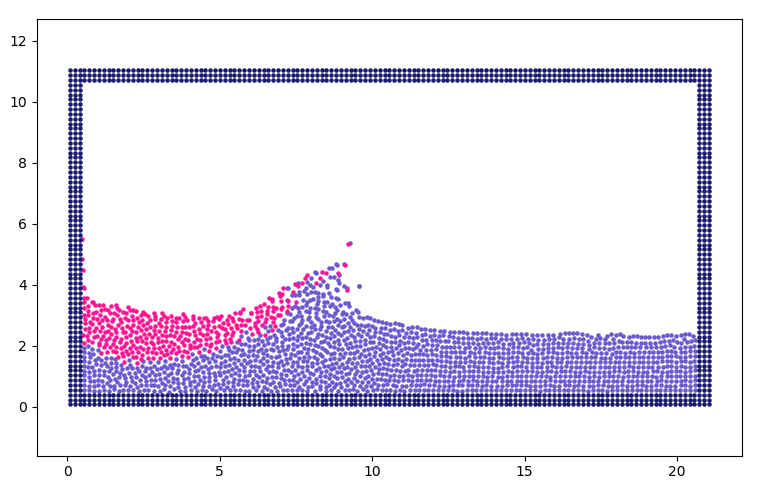

# SPH
Smoothed Particle Hydrodynamics (SPH) using OpenMP

Fig1: Snapshot of 2000 particles.

Fig2: Snapshot of 40000 particles.

**Compilation**

with OpenMP: g++ sph.cpp -O3 -fopenmp

without OpenMP: g++ sph.cpp -O3

**Post-processing**

python3 post_sph.py

Further implementations:
